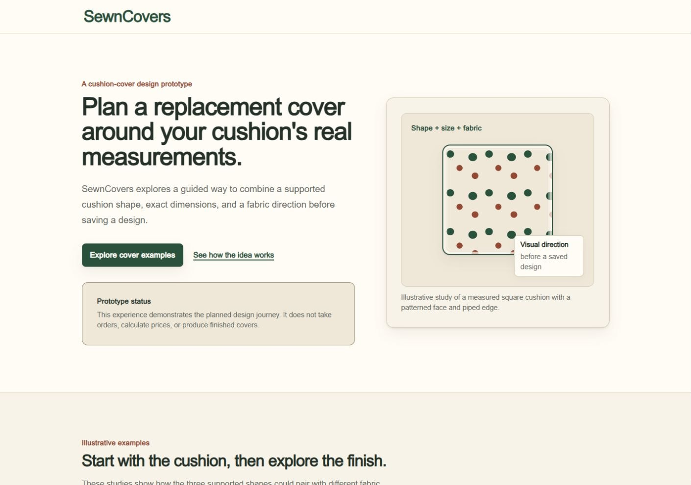
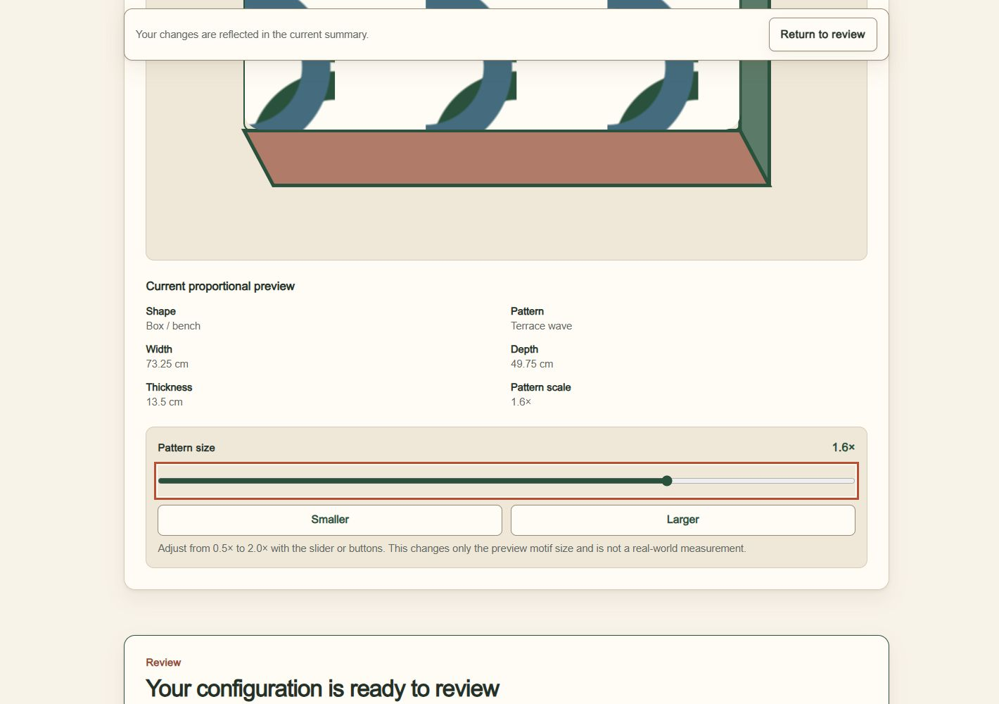
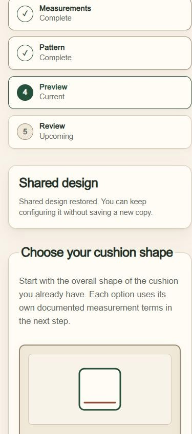
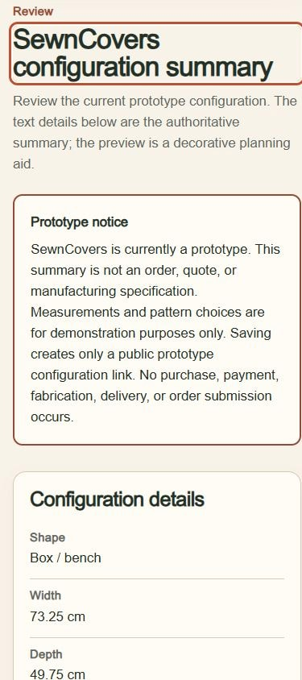
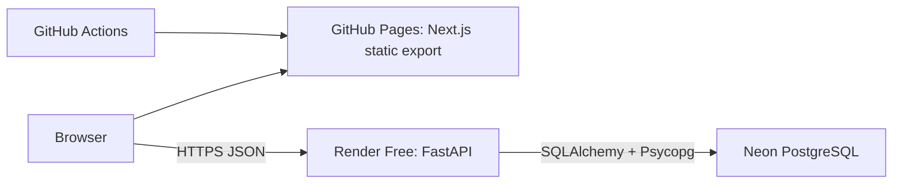

# SewnCovers

SewnCovers is a full-stack portfolio proof of concept for planning a replacement
cushion cover instead of replacing the cushion. A visitor chooses a supported
shape, enters exact measurements, selects one of 15 curated fabric patterns,
previews the result, reviews it, and saves an immutable configuration behind a
shareable link. Saving never places an order, requests a quote, or starts a
purchase.

| Public resource | URL |
| --- | --- |
| Case study | [Problem, constraints, decisions, outcome, and lessons](docs/CASE_STUDY.md) |
| Production boundaries | [Verified behavior, limitations, security boundaries, and commercial direction](docs/PRODUCTION_BOUNDARIES.md) |
| Live frontend | [nicolasfrechette91.github.io/SewnCovers/](https://nicolasfrechette91.github.io/SewnCovers/) |
| Configurator | [Open the configurator](https://nicolasfrechette91.github.io/SewnCovers/configure/) |
| Demonstration share | [Restore the Box / bench design](https://nicolasfrechette91.github.io/SewnCovers/configure/?design=fzlGCyCVpfiMf96geBq_jg) |
| Production API | [sewncovers-api.onrender.com](https://sewncovers-api.onrender.com) |
| API health | [sewncovers-api.onrender.com/health](https://sewncovers-api.onrender.com/health) |
| Swagger UI | [sewncovers-api.onrender.com/docs](https://sewncovers-api.onrender.com/docs) |
| OpenAPI JSON | [sewncovers-api.onrender.com/openapi.json](https://sewncovers-api.onrender.com/openapi.json) |

## Live-demo walkthrough

### 1. Start with the cushion

Visit the [live frontend](https://nicolasfrechette91.github.io/SewnCovers/), then
[open the configurator](https://nicolasfrechette91.github.io/SewnCovers/configure/)
and choose Square cushion, Rectangle cushion, or Box / bench cushion. The shape
sets the measurement terms used in the next step.



*The landing page introduces the project, its portfolio-prototype boundary, and
the measurement-first design idea.*

### 2. Configure and preview the cover

Enter the shape-specific measurements, choose a catalogue pattern, and adjust
Pattern size from `0.5×` to `2.0×` with the slider or Smaller and Larger
buttons. The demonstration below uses Box / bench, `73.25 × 49.75 × 13.5 cm`,
Terrace wave, and `1.6×`; the proportional preview and visible text summary
update together.



*The preview is a planning aid; its text summary remains the authoritative
description of the prototype configuration.*

### 3. Review, save, share, and restore

Choose **Review configuration**, check the summary, then use **Save and create
share link** and **Copy share link**. Every successful save creates a new
immutable public ID; saving identical values again intentionally creates a
separate record with another ID. Open the
[existing demonstration share](https://nicolasfrechette91.github.io/SewnCovers/configure/?design=fzlGCyCVpfiMf96geBq_jg)
directly—or refresh it—to restore the same seven configuration fields before
reviewing them again.

| Restored share | Mobile review |
| --- | --- |
|  |  |
| The immutable link restores the saved design without creating a new copy. | The responsive review keeps the configuration readable on a narrow screen. |

The [public API](https://sewncovers-api.onrender.com),
[interactive API documentation](https://sewncovers-api.onrender.com/docs), and
[health endpoint](https://sewncovers-api.onrender.com/health) are available for
reviewers who want to inspect the deployed service behind the walkthrough.

## What the MVP does

- Supports square, rectangle, and box / bench cushions.
- Validates dimensions in centimetres or inches and converts with
  `1 in = 2.54 cm`.
- Loads, filters, and orders the active pattern catalogue from the API while
  keeping pattern artwork in the frontend bundle.
- Renders a responsive, shape-aware 2D preview with adjustable pattern scale.
- Produces a reviewable, printable, and downloadable configuration summary.
- Creates immutable saved designs and restores all seven configuration fields
  from `?design=<public_id>`.
- Handles API wake-up, loading, empty, validation, retry, and recovery states
  without silently replacing the visitor's work.

The supported measurement contract is:

| Shape | Stored measurements | Interpretation |
| --- | --- | --- |
| `square` | `width`, equal `height`, `thickness` | The face must remain square. |
| `rectangle` | `width`, `height`, `thickness` | Width and height describe the face. |
| `box` | `width`, `height`, `thickness` | The UI labels stored `height` as depth. |

Width and height must be 10-300 cm equivalent, thickness must be 1-60 cm
equivalent, measurements allow at most two decimal places, and pattern scale is
0.5-2.0 at one-decimal resolution.

## Technology and responsibilities

| Area | Technology | Responsibility |
| --- | --- | --- |
| Web application | Next.js 16.2.11, React 19.2.4, TypeScript, Tailwind CSS 4 | App Router UI, typed configuration state, validation, static routes, 2D preview, and share-link experience. |
| Browser integration | Typed `fetch` client | Validates public API responses, applies bounded retries only to safe reads, and reports cold-start states. |
| API | Python 3.13, FastAPI 0.139.2, Pydantic Settings 2.13.1, Uvicorn 0.51.0 | Public HTTP contracts, CORS, business validation, error translation, and production process startup. |
| Persistence | SQLAlchemy 2.0.51, Psycopg 3.3.4, Alembic 1.18.5 | Lazy sessions, explicit transactions, PostgreSQL models, schema migrations, and the canonical seed. |
| Database | Neon PostgreSQL | Separate development and production branches containing catalogue metadata and immutable designs. |
| Hosting | GitHub Pages and Render Free | Static frontend delivery and the migration-gated FastAPI service. |
| Verification | Node test runner, React Testing Library, jsdom, Playwright 1.62.1, pytest 9.1.1, Ruff 0.15.22 | 70 frontend tests, a four-test browser journey, and 222 backend tests plus lint, type, build, export, and dependency checks. |

The frontend has a committed npm lockfile. Backend direct dependencies are
exact-pinned in `backend/pyproject.toml`; standard pip is used without a
backend lockfile to match the Render build.

## Architecture



Next.js exports static HTML, CSS, and JavaScript. GitHub Pages serves those
files under the case-sensitive `/SewnCovers` base path; there is no frontend
server or runtime SSR layer. The browser calls Render directly using the public
build-time `NEXT_PUBLIC_API_URL`. FastAPI is the only application component
that receives `DATABASE_URL` or connects to Neon.

## Repository map

| Path | Purpose |
| --- | --- |
| `frontend/app/` | Static App Router pages, metadata, and global layout. |
| `frontend/components/` | Configurator, landing, layout, and UI components. |
| `frontend/context/` | Typed configuration state, reducer, measurements, and conversions. |
| `frontend/services/` | API client, catalogue, save/share, and restoration boundaries. |
| `frontend/data/` | Supported shape metadata and frontend-owned pattern artwork handles. |
| `frontend/config/` | Environment validation and generated-export verification. |
| `frontend/tests/`, `frontend/e2e/` | Deterministic unit/component tests and Playwright journey. |
| `backend/app/` | FastAPI routes, services, repositories, settings, and persistence. |
| `backend/migrations/` | Linear Alembic schema/index/seed history. |
| `backend/tests/` | Isolated API, model, migration, production, and failure tests. |
| `.github/workflows/` | CI and GitHub Pages build/deployment workflows. |
| `docs/PROJECT_PROGRESS.md` | The authoritative 58-task roadmap and decision log. |
| `render.yaml` | Non-secret Render Blueprint configuration. |

Detailed component notes remain in the
[frontend guide](frontend/README.md) and [backend guide](backend/README.md).

## Prerequisites

- Git plus Node.js 20.9.0 or newer and npm. CI and deployment use Node.js
  24.15.0; use the committed `frontend/package-lock.json` with `npm ci`.
- Python 3.13 with `venv` and pip. CI and Render use Python 3.13.2.
- A private PostgreSQL development connection for database-backed local
  behavior. The project uses a direct Neon development-branch URL with
  `sslmode=require` and `channel_binding=require`; never use the production
  connection locally.

## Local frontend setup

1. Install the locked dependencies.

   ```powershell
   cd frontend
   npm ci
   ```

2. Create the ignored local environment file only if it does not exist.

   ```powershell
   if (-not (Test-Path .env.local)) { Copy-Item .env.example .env.local }
   ```

   On macOS/Linux use
   `test -e .env.local || cp .env.example .env.local`. The safe example points
   to `http://localhost:8000`.

3. Start Next.js and open <http://localhost:3000>.

   ```powershell
   npm run dev
   ```

## Local backend setup

1. From `backend`, create and activate a Python 3.13 virtual environment.

   ```powershell
   cd backend
   python -m venv .venv
   .venv\Scripts\Activate.ps1
   ```

   On macOS/Linux use
   `python3.13 -m venv .venv && source .venv/bin/activate`. Reuse an existing
   Python 3.13 environment rather than recreating it.

2. Install the application and development tools, then create the ignored
   settings file only if absent.

   ```powershell
   python -m pip install -e ".[dev]"
   if (-not (Test-Path .env)) { Copy-Item .env.example .env }
   ```

   On macOS/Linux use `test -e .env || cp .env.example .env`.

3. Start the development API.

   ```powershell
   python -m uvicorn app.main:app --reload
   ```

The root endpoint works without a database. `/health`, `/patterns`, and
`/designs` require a configured, migrated database. Stop either development
server with `Ctrl+C`.

## Environment variables

Populated `.env` and `.env.local` files are ignored. Values prefixed with
`NEXT_PUBLIC_` are embedded in browser JavaScript at build time and therefore
must never contain secrets.

| Variable | Owner / exposure | Requirement | Contract |
| --- | --- | --- | --- |
| `NEXT_PUBLIC_API_URL` | Frontend; **public** | Required when an API method runs; required for Pages builds | Absolute HTTP(S) URL without credentials, query, or fragment. Local example: `http://localhost:8000`. Pages requires exactly `https://sewncovers-api.onrender.com`. |
| `SEWNCOVERS_GITHUB_PAGES` | Frontend build; **public control** | Optional; set to `true` only for repository-path exports | Selects the case-sensitive `/SewnCovers` base path. Ordinary development/builds omit it. |
| `NEXT_FONT_GOOGLE_MOCKED_RESPONSES` | Frontend build; local path, not shipped config | Optional locally; set by CI quality builds | Points Next.js to `frontend/e2e/font-responses.cjs` for deterministic offline font builds. |
| `SEWNCOVERS_E2E` | Playwright runner; test-only | Runner-owned; do not set for deployment | Allows the Pages-layout browser test to use its intercepted `.test` API. |
| `ENVIRONMENT` | Backend; server-only, non-secret | Optional; defaults to `development` | One of `development`, `test`, or `production`. The production entry point requires `production`. |
| `FRONTEND_ORIGIN` | Backend; server-only, non-secret | Optional locally/test; required in production | One exact path-free HTTP(S) origin. Local default is `http://localhost:3000`; production accepts only `https://nicolasfrechette91.github.io`. |
| `PORT` | Backend; server-only, non-secret | Optional; defaults to `8000` | Integer 1-65535. Render supplies it; the production process binds `0.0.0.0`. |
| `DATABASE_URL` | Backend; **secret** | Required for database requests, online migrations, and production startup | Private SQLAlchemy URL. Locally use only `<NEON_DEVELOPMENT_DATABASE_URL>`; Render owns a separate protected production value. |
| `PYTHON_VERSION` | Render build; non-secret | Required by `render.yaml` | Pinned to `3.13.2`. |

`NEXT_PUBLIC_BASE_PATH` is generated by `next.config.ts`; it is not a
developer-supplied variable. No browser bundle receives backend settings.

## Database and migrations

### Initialize a development database

1. Put the private direct development connection in `backend/.env` as
   `DATABASE_URL=<NEON_DEVELOPMENT_DATABASE_URL>`. Do not paste the value into
   commands, logs, screenshots, or documentation.

2. Inspect the linear history and apply the forward migration from `backend`.

   ```powershell
   python -m alembic history --verbose
   python -m alembic heads --verbose
   python -m alembic current
   python -m alembic upgrade head
   ```

3. Confirm `python -m alembic current` reports `20260729_01 (head)`, then
   request `/health` and `/patterns`. A second upgrade must be a no-op.

Online `current`, `upgrade`, and `downgrade` commands need
`DATABASE_URL`. Inspection of history/heads and offline SQL do not:

```powershell
python -m alembic upgrade head --sql
python -m alembic downgrade head:base --sql
```

Do not downgrade, reset, recreate, or manually edit a shared Neon database.
Downgrade commands documented in the backend guide are only for isolated
development/test recovery.

### Migration history and current head

| Revision | Change |
| --- | --- |
| `20260728_01` | Creates `patterns` and `cover_designs` with named constraints. |
| `20260728_02` | Adds the non-redundant category and activity indexes. |
| `20260729_01` **(head)** | Seeds the canonical 15 active pattern metadata rows. |

Production startup additionally verifies this exact head, exactly the three
tables `alembic_version`, `patterns`, and `cover_designs`, the reviewed
constraint/index sets, and exactly 15 pattern rows before Uvicorn starts.

### Schema relationship and integrity

`patterns.id` has a one-to-many database relationship with
`cover_designs.pattern_id`. The named foreign key uses `ON UPDATE RESTRICT`
and `ON DELETE RESTRICT`, so referenced pattern IDs cannot be changed or
removed. The API and repository expose no design update or delete operation,
and ORM update/delete attempts are rejected.

| Table | Important columns | Important constraints and indexes |
| --- | --- | --- |
| `patterns` | String primary-key ID, visible metadata, JSON color IDs, preview handle, activity, display order | Unique name and preview handle; normalized/length/nonblank/category/order checks; `ix_patterns_category_id` and `ix_patterns_is_active`. The primary key already indexes slug lookup. |
| `cover_designs` | Internal integer primary key, unique 22-character public ID, shape, dimensions, unit, pattern ID, scale | Public-ID format, supported shape/unit, unit-aware ranges, square equality, and scale checks; restrictive pattern foreign key. The public-ID unique constraint already supports retrieval, so no redundant explicit design index exists. |

Dimensions use `NUMERIC(7,2)`; pattern scale uses `NUMERIC(2,1)`. Pattern
artwork, images, gradients, URLs, and filesystem paths are not stored in
PostgreSQL.

### Canonical pattern seed

The head migration inserts these 15 active records in deterministic display
order:

- Botanical: Botanical sample (`prototype-botanical`), Fern trail
  (`fern-trail`), Meadow sprig (`meadow-sprig`).
- Geometric: Geometric sample (`prototype-geometric`), Diamond path
  (`diamond-path`), Arch grid (`arch-grid`).
- Striped: Harbor stripe (`harbor-stripe`), Orchard stripe
  (`orchard-stripe`), Ribbon stripe (`ribbon-stripe`).
- Woven: Woven sample (`prototype-woven`), Basket check
  (`basket-check`), Linen crosshatch (`linen-crosshatch`).
- Abstract: Terrace wave (`terrace-wave`), Pebble drift
  (`pebble-drift`), Confetti grid (`confetti-grid`).

## Development and verification commands

### Everyday commands

| Directory | Command | Purpose |
| --- | --- | --- |
| `frontend` | `npm run dev` | Start the local Next.js server. |
| `frontend` | `npm run lint` | Run ESLint. |
| `frontend` | `npm run typecheck` | Run strict TypeScript checking without emit. |
| `frontend` | `npm run check:config` | Run focused build/environment tests. |
| `frontend` | `npm test` | Run all 70 deterministic frontend tests. |
| `frontend` | `npm run build` | Build the static export into ignored `frontend/out/`. |
| `frontend` | `npm run verify:export` | Verify exported routes, links, assets, base path, and API embedding. |
| `frontend` | `npm run test:e2e` | Build, serve, and run the four-test isolated Chromium journey. |
| `backend` | `python -m uvicorn app.main:app --reload` | Start the local API without automatic migrations. |
| `backend` | `python -m ruff format --check .` | Check Python formatting. |
| `backend` | `python -m ruff check .` | Run Ruff lint. |
| `backend` | `python -m pytest` | Run all 222 isolated backend tests. |
| `backend` | `python -m pip check` | Check installed dependency consistency. |

### CI-equivalent frontend gate

Run from `frontend` in PowerShell. The first export stays at the domain root;
the second reproduces the Pages build.

```powershell
npm ci
npm run lint
npm run typecheck
npm test
$env:NEXT_FONT_GOOGLE_MOCKED_RESPONSES = (Resolve-Path e2e\font-responses.cjs).Path
npm run build
npm run verify:export
$env:NEXT_PUBLIC_API_URL = "https://sewncovers-api.onrender.com"
$env:SEWNCOVERS_GITHUB_PAGES = "true"
npm run build
npm run verify:export
Remove-Item Env:SEWNCOVERS_GITHUB_PAGES, Env:NEXT_PUBLIC_API_URL, Env:NEXT_FONT_GOOGLE_MOCKED_RESPONSES -ErrorAction SilentlyContinue
```

The CI job uses Node.js 24.15.0 on Ubuntu 24.04 and the same scripts. It does not
run Playwright. For the local browser gate, install the pinned Chromium runtime
once with `npx playwright install chromium`, run `npm run test:e2e`, then
repeat with `SEWNCOVERS_GITHUB_PAGES=true` to exercise `/SewnCovers`.

### CI-equivalent backend gate

Run from `backend` in an active Python 3.13 environment:

```powershell
python -m pip install -e ".[dev]"
python -m ruff format --check .
python -m ruff check .
python -m pytest
python -m pip check
```

The CI job uses Python 3.13.2 on Ubuntu 24.04. Tests use dependency overrides and
isolated SQLite databases; neither quality gate contacts Neon or Render or
requires a populated environment file.

## Public API contract

The API exposes five application paths. Swagger UI, ReDoc, and OpenAPI are also
available at `/docs`, `/redoc`, and `/openapi.json`.

| Method and path | Successful behavior | Important failures |
| --- | --- | --- |
| `GET /` | `200 {"service":"SewnCovers API","status":"ready"}`; does not start database work. | Stable process verification only. |
| `GET /health` | `200 {"process":"healthy","database":"healthy"}` after one `select(1)`. | `503` with database `unconfigured` or `unavailable`; it uses `HealthResponse`, not the general error envelope. |
| `GET /patterns` | `200` bare array of active public pattern metadata, ordered by display order then ID. Optional `category` and `color` filters are normalized and combined with AND semantics; valid no-match filters return `[]`. | `422` invalid filter or unsupported query field, `503` storage unavailable, `500` unexpected failure. |
| `POST /designs` | `201` exact saved-design response plus `Location: /designs/{publicId}`. Every request field is required and the selected pattern must be active. | `422` schema/business/pattern failure, `503` storage or ID generation unavailable, `500` unexpected failure. |
| `GET /designs/{public_id}` | `200` exact immutable public design for a 22-character URL-safe ID. | `404` well-formed unknown ID, `422` malformed ID, `503` storage unavailable, `500` unexpected failure. |

`GET /patterns` serializes `id`, `name`, `description`, `categoryId`,
`colorIds`, and `previewClassName`; internal activity and display order are
not public. Design creation accepts:

```json
{
  "shape": "rectangle",
  "width": 61.75,
  "height": 39.5,
  "thickness": 14.25,
  "unit": "cm",
  "patternId": "arch-grid",
  "patternScale": 1.4
}
```

The response adds only `publicId` and returns the validated configuration:

```json
{
  "shape": "rectangle",
  "width": 61.75,
  "height": 39.5,
  "thickness": 14.25,
  "unit": "cm",
  "patternId": "arch-grid",
  "patternScale": 1.4,
  "publicId": "<22-character-public-id>"
}
```

Non-health API failures use a deterministic
`{"errors":[{"code","message","location"}]}` envelope. Clients should branch
on the stable error `code`, not the human-readable message. See the
[backend API guide](backend/README.md#api-error-contract) for the complete
field and error tables.

## Immutable saves and share-link restoration

Each successful `POST /designs` is a create operation. The service generates a
new random 22-character opaque public ID and inserts one append-only record.
Repeated identical POST bodies intentionally create separate records with
different IDs; there is no content deduplication, idempotency key, overwrite,
update, or delete behavior.

That also makes design creation an unsafe operation to retry. If the database
commits but the response is lost, an automatic retry could create a second
record. The browser client therefore gives `POST /designs` one attempt, blocks
duplicate in-flight submissions, and requires an explicit user retry after an
ambiguous failure. Safe GETs may retry transient failures up to two additional
sequential attempts.

Share links contain only `?design=<public_id>`. Restoration validates the ID
locally, retrieves the exact public record, waits for its pattern to exist in
the current API catalogue, and atomically restores `shape`, `width`,
`height`, `thickness`, `unit`, `patternId`, and `patternScale`.
Malformed, unknown, unavailable-pattern, failed, stale, or superseded loads keep
the visitor's current configuration. A share ID is opaque, but it is not an
authentication or privacy boundary.

## Production deployment

| Layer | Production contract |
| --- | --- |
| Frontend | GitHub Pages serves `https://nicolasfrechette91.github.io/SewnCovers/` from `frontend/out`. `SEWNCOVERS_GITHUB_PAGES=true` selects `basePath="/SewnCovers"`; `assetPrefix` is intentionally unset. |
| Frontend API configuration | The Pages workflow embeds exactly `NEXT_PUBLIC_API_URL=https://sewncovers-api.onrender.com` and rejects another value before building. |
| API | Render Free builds from `backend` with `python -m pip install .` and starts with `python -m app.production` in Ohio. |
| CORS | Production allows exactly `https://nicolasfrechette91.github.io`. The `/SewnCovers/` path is not part of an origin. Allowed methods are GET/POST, credentials are disabled, and CORS is not authentication. |
| Database | FastAPI alone uses Render's protected production `DATABASE_URL` to reach the isolated Neon production branch. No credential is stored in this repository. |
| Health | Render probes `/health`; HTTP 200 requires both the process and database query to be healthy. |

Render Free does not provide the paid pre-deploy migration command. The
repository-owned production entry point therefore validates production
settings, runs `alembic upgrade head`, verifies revision/schema/index/seed
compatibility, and starts Uvicorn only after both steps succeed. Render supplies
`PORT`; Uvicorn binds `0.0.0.0`.

GitHub Actions runs frontend lint, type-check, tests, ordinary and Pages builds,
and export verification plus backend Ruff, tests, and `pip check` on pushes to
`main` and pull requests targeting `main`. The Pages workflow builds and
publishes only `frontend/out`. Render auto-deploys after checks pass.

## Engineering decisions and trade-offs

| Decision | Benefit | Trade-off |
| --- | --- | --- |
| Static Next.js export on GitHub Pages | Simple, inexpensive, cacheable frontend with no runtime web server. | No SSR/server actions; public configuration is fixed at build time, and every route/asset must respect the case-sensitive repository base path. |
| Render and Neon free tiers | Keeps the public portfolio demo inexpensive and separates compute from persistence. | Render can sleep after inactivity, making the first request slow; free quotas and provider availability are operational constraints. |
| Immutable saved designs | Share links restore a stable historical configuration and persistence exposes a very small create/read surface. | Records cannot be edited or deleted, identical creates consume separate rows, and retention/storage growth is not automated. |
| No automatic POST retry | Avoids silently creating another immutable record after an ambiguous successful write. | A visitor must choose whether to retry, and a manual retry can still create a second record. |
| Bounded retry for safe GETs | Improves recovery from cold starts and transient network/5xx failures. | A wake-up can still exceed the client timeout/retry window and cannot guarantee availability. |
| Frontend-owned pattern artwork | Keeps binary/static assets on static hosting and PostgreSQL focused on queryable metadata. | Catalogue metadata and shipped visual handles must stay compatible across deployments. |
| Synchronous SQLAlchemy sessions | Compact, explicit transaction ownership for this small request workload. | High-concurrency production growth could justify revisiting worker and async strategy. |
| Public, account-free MVP | Reviewers can use the full journey without signup or personal data. | There is no authentication, authorization, ownership, private sharing, rate limiting, abuse control, or user-managed deletion. Opaque IDs and CORS do not supply those controls. |

## Troubleshooting

| Symptom | Check and resolution |
| --- | --- |
| Frontend shows an API configuration or catalogue error | Confirm `frontend/.env.local` contains only a valid public `NEXT_PUBLIC_API_URL=http://localhost:8000`, restart `npm run dev`, and make sure the backend and migrated development database are running. |
| Backend root works but `/health` is 503 | `database:"unconfigured"` means `DATABASE_URL` is missing/invalid; `database:"unavailable"` means configuration succeeded but the query failed. Check the private development branch/database/role, direct URL, SSL parameters, network, and migration state without printing the URL. |
| Alembic cannot connect or reports the wrong revision | Run commands from `backend` with the Python 3.13 environment active. Keep the development URL only in `.env`, inspect `heads` and `current`, then apply the forward `upgrade head`. Stop on drift; do not repair shared databases with reset/downgrade/manual edits. |
| Browser reports CORS failure | Local frontend origin must match `FRONTEND_ORIGIN` exactly, normally `http://localhost:3000`. Production must use `https://nicolasfrechette91.github.io` without `/SewnCovers`, a trailing path, or the Render origin. Direct non-browser success does not prove browser CORS permission. |
| Pages route, CSS, script, favicon, or refresh returns 404 | Build with `SEWNCOVERS_GITHUB_PAGES=true`, preserve uppercase `/SewnCovers`, use Next.js-aware links, and run `npm run verify:export`. Ordinary local exports intentionally use the domain root. |
| First production request is slow or times out | Render Free may be waking. Wait and retry safe reads. The UI reports possible wake-up after two seconds and retries transient GETs within its bounded policy. Do not automatically replay a design POST; inspect the original outcome or use the explicit save retry knowing it may create another record. |
| Static build tries to fetch fonts | Set `NEXT_FONT_GOOGLE_MOCKED_RESPONSES` to the absolute `frontend/e2e/font-responses.cjs` path, matching CI. |

## Current boundaries and future production work

This remains a portfolio MVP, not a commerce or manufacturing system. It has no
accounts, authentication, authorization, private projects, uploads, pricing,
quotes, cart, payments, orders, inventory, fulfilment, administration,
analytics, moderation, legal/trust workflow, or complex/photorealistic cushion
modeling. It stores public configuration data only; it should not be used for
personal, confidential, payment, or production-order information. Provider
free-tier limits and cold starts remain part of the demo's availability model.

Sensible future production improvements—not implemented today—include:

- Authentication, per-design authorization/privacy, retention controls, and a
  deliberate deletion/audit policy.
- Rate limiting, abuse monitoring, observability, backups/recovery exercises,
  and always-on or scaled infrastructure.
- Idempotency keys or client operation IDs if create retries must become safe,
  with an explicit migration and API-contract change.
- Object storage, validation, processing, and moderation before accepting
  customer-uploaded artwork.
- Richer shapes, construction/material/fit choices, pricing and quote/order
  workflows, accessible advanced visualization, and production administration.

See [docs/PROJECT_PROGRESS.md](docs/PROJECT_PROGRESS.md) for the exact roadmap,
current handoff, and historical engineering decisions.
