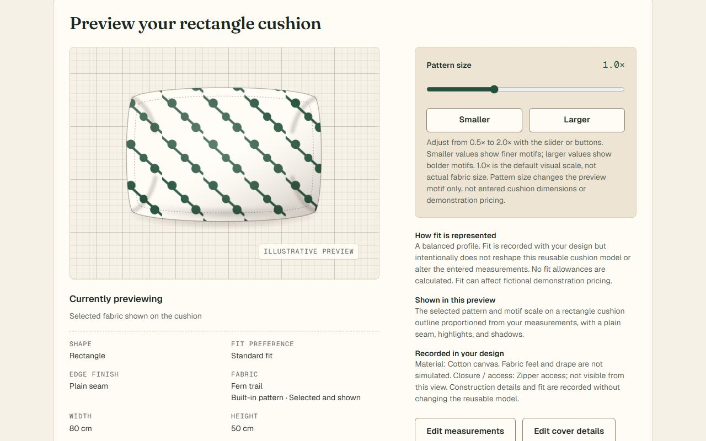
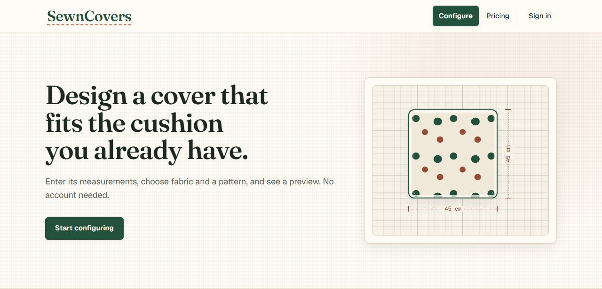
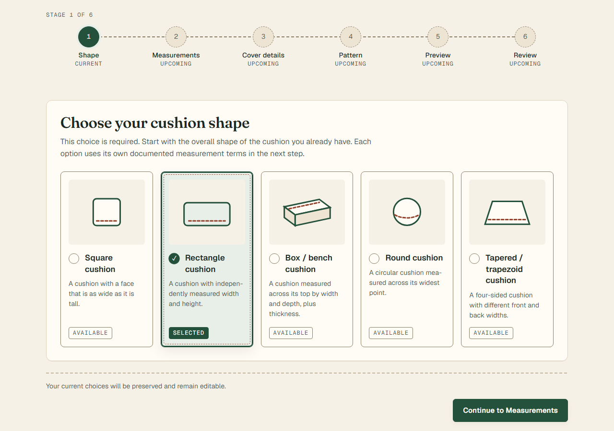
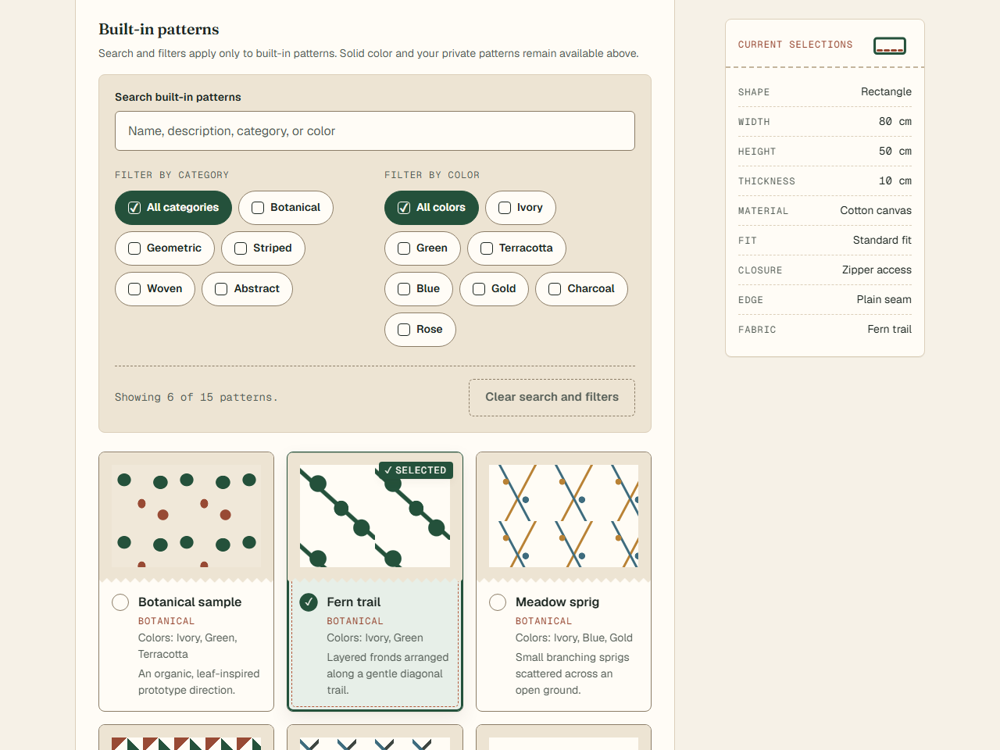
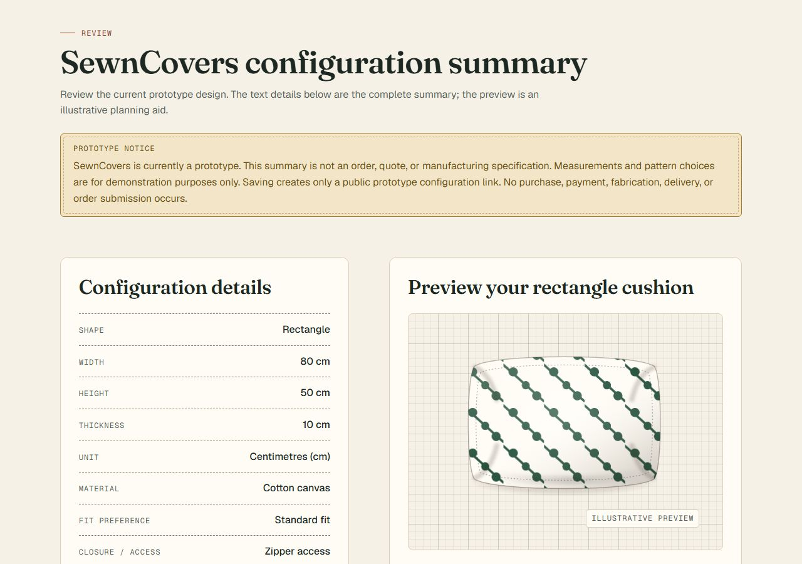
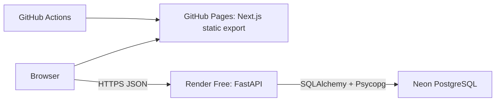

# SewnCovers

Measure the cushion you already own, pick a fabric, and get a previewed, shareable specification for a replacement cover. A full-stack portfolio project: Next.js on GitHub Pages, FastAPI on Render, PostgreSQL on Neon.

[](https://github.com/nicolasfrechette91/SewnCovers/actions/workflows/deploy-pages.yml)
[](https://github.com/nicolasfrechette91/SewnCovers/actions/workflows/deploy-backend.yml)
[](https://github.com/nicolasfrechette91/SewnCovers/actions/workflows/keep-warm.yml)



- **Live demo:** [nicolasfrechette91.github.io/SewnCovers](https://nicolasfrechette91.github.io/SewnCovers/) ([open the configurator](https://nicolasfrechette91.github.io/SewnCovers/configure/))
- **Demo share link:** [a saved box cushion in Terrace wave](https://nicolasfrechette91.github.io/SewnCovers/configure/?design=fzlGCyCVpfiMf96geBq_jg), restored exactly from the API
- **API docs:** [Swagger UI](https://sewncovers-api.onrender.com/docs) · [OpenAPI JSON](https://sewncovers-api.onrender.com/openapi.json) · [health](https://sewncovers-api.onrender.com/health)

The API runs on a free Render instance. A scheduled ping keeps it awake from 07:00 to 23:00 Toronto time; outside those hours the first request can take up to a minute, and the site shows a waking notice and retries reads for you.

| Home | Shape stage |
| --- | --- |
|  |  |
| **Pattern stage** | **Review stage** |
|  |  |

## What this demonstrates

- **A static frontend on a separate API.** Next.js 16 exported to GitHub Pages with no frontend server and no third-party runtime dependencies, validating every API response at runtime ([architecture](docs/architecture.md)).
- **Immutable share links with an explicit no-retry policy.** A saved design never changes, and the client never silently retries the write ([ADR 0002](docs/adr/0002-immutable-designs-no-post-retry.md)).
- **A production start that refuses a wrong schema.** The API migrates, verifies the exact schema, constraints and seed, and only then serves ([ADR 0003](docs/adr/0003-migration-gated-production-start.md)).
- **Guest-first accounts.** The whole design flow works without signing up; sign-in is inline and never costs the design. Argon2id passwords, hashed and revocable bearer sessions, object-level authorization ([ADR 0004](docs/adr/0004-guest-first-opaque-sessions.md)).
- **A documented, enforced design system.** Tokens, checked contrast ratios, reduced-motion and forced-colours support, guarded by a test ([design](docs/design.md)).
- **Offline-by-construction tests.** 187 frontend unit tests, 60 Playwright journeys against a mocked API, and 290 backend tests on migrated SQLite databases, all run by CI before either side deploys ([testing](docs/testing.md)).

The reasoning behind the project is in the [case study](docs/case-study.md).

## Tech stack

| Layer | Technology |
| --- | --- |
| Frontend | Next.js 16 (App Router, static export), React 19, TypeScript (strict), Tailwind CSS v4, self-hosted fonts |
| API | Python 3.13, FastAPI, Pydantic v2, Argon2id |
| Data | PostgreSQL on Neon, SQLAlchemy 2 (synchronous), Alembic; SQLite for local work and tests |
| Tests | Node test runner, tsx + jsdom + React Testing Library, Playwright, pytest, Ruff |
| Delivery | GitHub Actions, GitHub Pages, Render |

## Architecture


```mermaid
flowchart LR
    Actions["GitHub Actions"] --> Pages["GitHub Pages: Next.js static export"]
    Browser["Browser"] --> Pages
    Browser -->|"HTTPS JSON"| Render["Render Free: FastAPI"]
    Render -->|"SQLAlchemy + Psycopg"| Neon["Neon PostgreSQL"]
```

GitHub Actions builds the static site and publishes it to Pages under the `/SewnCovers` base path. The browser loads it, then calls the API directly at a build-time URL. FastAPI is the only component that holds the database credential. Because the site and API are on different domains, sessions use opaque bearer tokens instead of cookies. See [architecture](docs/architecture.md).

## Run it locally

You need Node.js 24 (24.15.0 or a later 24.x) and Python 3.13. No Neon account is required: the API runs on a local SQLite file.

```powershell
# Frontend, http://localhost:3000
cd frontend
npm ci
if (-not (Test-Path .env.local)) { Copy-Item .env.example .env.local }; npm run dev
```

```powershell
# API, http://127.0.0.1:8000 (second terminal)
cd backend
python -m venv .venv; .venv\Scripts\Activate.ps1
python -m pip install -e ".[dev]"
$env:DATABASE_URL = "sqlite:///./local.sqlite3"
python -m alembic upgrade head
python -m uvicorn app.main:app --reload
```

macOS and Linux commands, PostgreSQL, and how to switch on commerce and custom uploads locally are in the [setup guide](docs/setup.md).

## Engineering decisions

| Decision | Benefit | Trade-off |
| --- | --- | --- |
| [Static export on GitHub Pages](docs/adr/0001-static-export-on-github-pages.md) | Free, cacheable, nothing to patch | No SSR; config fixed at build time; base path everywhere |
| [Immutable designs, no POST retry](docs/adr/0002-immutable-designs-no-post-retry.md) | A link always shows what was saved | Duplicate rows on manual retry; no delete |
| [Migration-gated start-up](docs/adr/0003-migration-gated-production-start.md) | Fails closed on schema drift | Slower cold start |
| [Opaque, hashed bearer sessions](docs/adr/0004-guest-first-opaque-sessions.md) | Works across domains; no CSRF surface | Token readable by injected script |
| [Metadata in the API, artwork in the frontend](docs/adr/0005-catalogue-metadata-in-api-artwork-in-frontend.md) | No image requests; no binaries in the database | Two sources to keep in sync |
| [Feature flags, off in production](docs/adr/0006-feature-flags-off-in-production.md) | Full pipeline without cost or risk | Not demonstrable on the live site |

## Honest boundaries

- **Custom uploads and commerce are switched off in production.** Both are implemented and tested, but the live API answers `503` for them. Uploads need object storage and an image-moderation provider, commerce needs a payment provider, tax and legal review, and none of that is worth operating for a portfolio. Both run locally ([setup](docs/setup.md#3-turn-on-commerce-and-custom-uploads-locally)). Commerce is a fictional CAD sandbox that never contacts a provider.
- **It is a prototype.** It cannot charge money, ship anything or produce a finished cover, and says so where it matters.
- **Authentication is portfolio-grade.** No email verification or password recovery, and the session token lives in `sessionStorage`. Sign-in attempts are slowed per network and per email with a backoff kept in the database, so it survives restarts ([limits](docs/api.md#limits)). See [SECURITY.md](SECURITY.md).
- **Free tiers mean cold starts.** The keep-warm ping covers waking hours only, and GitHub can delay or pause scheduled runs ([deployment](docs/deployment.md#free-tier-behaviour)).

## Repository map

| Path | Contents |
| --- | --- |
| `frontend/` | Next.js app: routes, configurator, design system, API clients, tests ([readme](frontend/README.md)) |
| `backend/` | FastAPI service, Alembic migrations, pytest suite ([readme](backend/README.md)) |
| `docs/` | Guides, ADRs, design system, case study and screenshots |
| `.github/` | One reusable CI workflow, the Pages and Render deploys that call it, the keep-warm ping, Dependabot |
| `render.yaml` | Render service definition (no secrets) |
| `AGENTS.md`, `SECURITY.md` | Contributor and agent notes; vulnerability reporting |

## Documentation

[Setup](docs/setup.md) · [Architecture](docs/architecture.md) · [API](docs/api.md) · [Database](docs/database.md) · [Deployment](docs/deployment.md) · [Testing](docs/testing.md) · [Design system](docs/design.md) · [Case study](docs/case-study.md) · [ADRs](docs/adr/)

## License

[MIT](LICENSE)
