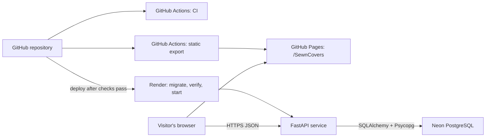

# SewnCovers case study

## Executive summary

SewnCovers is a full-stack portfolio prototype for planning a replacement
cushion cover around an existing cushion. It helps a visitor turn a loosely
described idea into a consistent specification: choose a supported shape,
enter measurements, compare fabric patterns, adjust visual pattern scale,
review the result, and share it.

The delivered application combines a statically exported Next.js frontend, a
FastAPI service, and PostgreSQL persistence. It supports square, rectangle, and
box / bench cushions; centimetre and inch measurements; an API-backed catalogue
of 15 curated patterns; a responsive proportional preview; and public share
links. A saved design is immutable: the API can create and retrieve it, but
offers no update or delete operation. That narrow lifecycle keeps a shared link
stable and makes the prototype's system boundary explicit.

This project was not positioned as a commerce system. It does not calculate a
price, accept an order, collect customer details, or represent a
manufacturing-ready specification. The result is a deployed, reviewable design
journey with its limitations documented instead of hidden.

### Local Phase 10 follow-on

The current worktree now extends that deployed case study with five shapes,
construction choices, materials, fit preferences, and an optional account
workspace. Task 10.2 adds Argon2id accounts, expiring/revocable hashed bearer
sessions, private named projects, immutable full-snapshot versions, revocable
hashed read-only share grants, export, and confirmed deletion. It preserves the
deployed anonymous immutable-design contract. These additions are local only:
they were not migrated or deployed to the live service and should not be read
as a production availability or security claim.

## Problem

Custom cover discussions combine several kinds of information that are easy to
miscommunicate. Shape changes which dimensions matter. Width, height or depth,
and thickness need units and validation. A fabric name alone does not convey
the direction or relative scale of a motif. Even when each choice is understood
individually, the complete design can still be difficult to review or hand to
someone else without losing context.

SewnCovers addresses that communication problem by keeping dimensions, shape,
fabric direction, pattern scale, and a visible summary in one guided flow. The
preview is deliberately described as a planning aid rather than a physical
simulation; the accompanying text remains the authoritative description. A
share URL then restores the same stored fields, avoiding a second person having
to reconstruct the configuration from prose or screenshots.

*A configured Box / bench example keeps measurements, pattern identity, scale,
and the proportional preview in the same view.*

## Goals and success criteria

The intended journey was straightforward: measure an existing cushion, explore
a fabric direction, review the combined idea, and save a link that can restore
it later. The implementation translated that journey into concrete criteria:

- Support three clearly defined cushion shapes with shape-specific measurement
  labels and rules.
- Accept centimetres and inches, preserve practical decimal input, and enforce
  the same unit-aware limits in the browser, API, and database.
- Load and filter a deterministic pattern catalogue from the API while keeping
  visual artwork in the static frontend bundle.
- Show a responsive, shape-aware 2D preview with adjustable motif scale and an
  equivalent textual summary.
- Prevent incomplete configurations from reaching review or persistence.
- Create a public link from a reviewed configuration and restore all seven
  public fields exactly: shape, width, height, thickness, unit, pattern ID, and
  pattern scale.
- Keep frontend hosting, API access, database credentials, CORS, and repository
  base paths within explicit production boundaries.
- Make the complete journey usable with a keyboard, resilient at narrow
  viewports, and understandable during loading and failure states.
- Verify behavior at unit, component, API, migration, browser, accessibility,
  build, deployment, and live-service boundaries.

## Constraints

| Constraint | Effect on the design |
| --- | --- |
| Static GitHub Pages hosting | The Next.js application must export HTML, CSS, and JavaScript. It cannot depend on runtime SSR, API routes, or Server Actions. |
| Separate Render API and Neon PostgreSQL | The browser calls Render over HTTPS; only FastAPI receives `DATABASE_URL` and connects to Neon. |
| Portfolio-scale free-tier infrastructure | Render can sleep after inactivity, so the first request may take long enough to require visible wake-up messaging and bounded recovery. |
| Deployed release has no authentication or destructive design management | Its share IDs are public opaque locators, not access control. The newer local account/project lifecycle is separate and undeployed. |
| Immutable shareable designs | Every successful creation inserts a new record whose public representation remains stable. Retention and storage growth are accepted MVP trade-offs. |
| Exact deployment boundaries | Pages uses the case-sensitive `/SewnCovers` base path, the frontend embeds one exact production API URL, and CORS permits one exact path-free Pages origin. |
| Responsive and keyboard-accessible interaction | Controls, status messages, focus movement, summaries, and the preview must remain useful without a pointer and without horizontal overflow on narrow screens. |

These constraints favored a small and auditable surface over feature breadth.
They also ruled out convenient shortcuts: browser code cannot connect directly
to PostgreSQL, CORS cannot use a wildcard, and a share ID cannot be described as
private merely because it is difficult to guess.

## Architecture

Next.js uses the App Router but produces a static export. GitHub Pages serves
that export beneath `/SewnCovers`; there is no frontend application server.
The production build embeds the public `NEXT_PUBLIC_API_URL` value and generates
the `NEXT_PUBLIC_BASE_PATH` value used by browser-side links and static assets.
Ordinary local builds remain at the domain root.

The browser retrieves pattern metadata and saved designs directly from the
FastAPI service on Render. FastAPI owns HTTP validation, business rules,
transaction boundaries, safe error translation, and the only connection to
Neon PostgreSQL. PostgreSQL holds ordered catalogue metadata and append-only
cover designs; CSS-based pattern artwork stays in the frontend bundle.

Two GitHub Actions workflows enforce the repository boundary. CI checks the
frontend and backend on pushes and pull requests, while the Pages workflow
builds, verifies, and publishes only `frontend/out`. Render is configured to
deploy from `main` after checks pass. Because the free Render plan does not
provide a separate pre-deploy command, its production entry point runs Alembic
to `head`, verifies the expected revision, tables, constraints, indexes, and
15-row seed, and starts Uvicorn only if those checks succeed.

## Key decisions and trade-offs

| Decision | Reasoning | Accepted trade-off |
| --- | --- | --- |
| Static export instead of a server-rendered frontend | GitHub Pages provides a simple public portfolio host, and the configurator's runtime work can happen in the browser. | No SSR or server actions; routing, assets, and public configuration must be correct at build time. |
| API-backed catalogue with frontend-owned artwork | PostgreSQL remains the source of truth for active, ordered, filterable metadata, while static CSS visuals avoid storing or serving binary assets from the API. | Database metadata and shipped visual mappings must remain compatible. |
| Immutable saved designs | Create/read semantics keep the API small and ensure an existing link continues to represent the stored configuration. | There is no edit, delete, retention, or user-ownership workflow. |
| Random IDs and create-new-record semantics | Each creation receives a 128-bit, 22-character URL-safe opaque ID independent of the internal database key. Repeated identical saves are still separate successful creations. | There is no content deduplication or idempotency key; equivalent records can coexist. |
| Explicit CORS allowlisting | The deployed browser boundary is exactly `https://nicolasfrechette91.github.io`, with only `GET` and `POST`. The local account API expands methods to DELETE/GET/PATCH/POST and adds `Authorization`, still with credentials disabled. | Alternate origins, custom domains, and lookalikes require deliberate configuration changes. CORS remains browser policy, not authentication. |
| Migration before server startup | A process should not serve against an unknown schema or incomplete catalogue. Startup fails closed if migration or verification fails. | Startup does more database work and wake-up latency includes the gate. |
| Share URLs use `?design=<public_id>` | One static `/configure/` route can load a design without adding dynamic server-rendered routes or path-generation logic. | The ID is visible in browser history and must be treated as public. |
| Deterministic restoration | The client validates the exact API response, waits for the selected API pattern, then applies one atomic reducer action. Request generations and state revisions prevent late responses from overwriting user edits. | Restoration logic must coordinate two asynchronous reads and expose explicit recovery states. |
| Free-tier hosting | GitHub Pages, Render Free, and portfolio-scale Neon infrastructure keep the public demonstration inexpensive. | Render may sleep after inactivity. A wake can outlast the client's timeout/retry window, and free-tier availability is not an always-on service guarantee. |

One trade-off deserves particular emphasis: `POST /designs` is unsafe to retry
automatically. If the database commits but the response is lost, replaying the
request can create another valid immutable record. The browser therefore makes
one create attempt, blocks simultaneous submissions, and requires the visitor
to decide whether to retry. Safe `GET` operations can use bounded transient
retries.

## Engineering challenges

### Base-path-safe navigation and assets

The repository path is case-sensitive in production. An early live deployment
revealed that lowercase asset URLs could return semantic HTML while leaving the
application unstyled and unhydrated. The final build uses the exact
`/SewnCovers` path, relies on Next.js `basePath` handling, and verifies generated
routes, metadata, assets, navigation, and share URLs in both domain-root and
Pages modes.

### Production API isolation and CORS correctness

The Pages build must contain exactly the public Render API origin and no local,
test, database, or credential values. Conversely, FastAPI accepts the exact
path-free Pages origin; `/SewnCovers` is a URL path and never belongs in an
Origin header. Settings validation, deployment-configuration tests, generated
bundle scans, and live allowed/disallowed-origin checks protect both sides of
that boundary.

### Responsive preview behavior

The preview has to communicate shape and proportions without pretending to be
a manufacturing model. Geometry is derived from validated measurements and
bounded to its container; pattern scale changes only the motif presentation.
The same state drives visible dimension and pattern text so the design remains
understandable when the visual is small, incomplete, or unavailable.

### Loading, retry, and recovery states

Separating static hosting from a sleeping API makes waiting part of the product
experience. The client distinguishes connecting, a cautious “may be waking”
message, bounded read retries, final failure, and recovery. Catalogue filters
ignore stale responses, failed loads preserve configuration, and a visitor can
retry safe reads without silently substituting bundled data.

### Keyboard interaction and focus continuity

Native controls provide predictable radio, input, slider, and button behavior,
but multi-step focus still required explicit ownership. Review transitions move
focus to the relevant heading; edit actions return to their section; successful
saving focuses and selects the new URL; and failed clipboard access selects the
same field for manual copying. Live keyboard verification exercised the public
journey without pointer-driven DOM shortcuts.

## Testing and verification

Verification was organized around boundaries rather than a single happy-path
test. Frontend unit and component coverage exercises measurement parsing and
conversion, reducer invariants, proportional preview calculations, catalogue
filtering, stale-response protection, save failures, retry rules, share URL
construction, and atomic restoration. Browser tests run the real static export
in ordinary and Pages base-path modes and cover the complete configure, review,
save, share, refresh, and restore journey.

Backend tests use isolated SQLite databases and dependency overrides rather
than production services. They cover health behavior, typed errors, exact CORS
policy, pattern filtering, design validation and immutability, collision and
transaction handling, migrations, schema/model parity, production startup
ordering, OpenAPI exposure, and secret-safe failure messages. CI adds linting,
strict TypeScript, Ruff, dependency consistency, builds, and generated-export
inspection.

Accessibility verification includes semantic structure, accessible names and
descriptions, live-region behavior, keyboard focus, narrow-screen reflow,
control target sizing, contrast calculations, forced-colors emulation, and
reduced-motion behavior. Those automated and browser checks validate the
application-owned contract; they are not an accessibility certification.
Platform-specific NVDA and VoiceOver sessions, non-emulated Windows High
Contrast, physical touch-device comfort, and native print, download, and denied
clipboard dialogs still require manual assistive-technology and operating-system
testing.

Deployment verification covered the built browser bundle, exact CORS responses,
API health, the 15-pattern catalogue, OpenAPI paths, mobile and keyboard use,
the immutable create semantics, and exact restoration after opening and
refreshing a public share. The public links in this document were rechecked with
read-only requests on August 11, 2026; no production record was created for this
case study.

## Outcome

The demonstrated result is a deployed end-to-end journey. A visitor can open
the GitHub Pages application, configure any of the three supported cushion
shapes, use validated metric or imperial measurements, filter and choose from
15 API-provided patterns, adjust motif scale, inspect a responsive proportional
preview, and review a textual summary.

Saving creates a separate immutable design with a new opaque ID—even when the
same values were saved before. Its share link retrieves the stored record and
restores every public configuration field exactly, including after a direct
page load or refresh. The existing demonstration share has been verified on the
deployed application and against the production API.

*The same share contract works at a narrow viewport and preserves the saved
configuration without creating another record.*

The production Pages routes, Render API, database-aware health endpoint,
pattern catalogue, interactive API documentation, and OpenAPI document all
responded successfully during final read-only verification. Responsive audits
found no horizontal overflow at the tested mobile, tablet, and desktop sizes,
and the deployed journey was completed with native keyboard interaction. These
are demonstrated engineering outcomes; the repository contains no evidence of
user adoption, revenue, production traffic, or commercial-scale performance.

## Lessons learned

1. **A static frontend still has production architecture.** Base paths,
   build-time configuration, browser-to-API calls, CORS, and generated assets
   become primary system concerns when there is no frontend server to absorb
   routing mistakes.
2. **Immutability must be defined with retry semantics.** “Saved forever” is
   incomplete unless the design also explains what happens after an ambiguous
   response. Single-attempt creates are the honest MVP behavior here.
3. **CORS and opaque IDs are not security features.** Both are useful controls,
   but neither provides identity, authorization, ownership, or privacy.
4. **Restoration is a concurrency problem, not just a fetch.** The design and
   catalogue arrive independently, and either can become stale after a user
   edit. Atomic state updates plus request generations make the result
   deterministic.
5. **Operational constraints belong in the interface.** A free-tier cold start
   is not only a hosting fact; it changes timeout, retry, status messaging, and
   the difference between safe reads and unsafe writes.
6. **Text should carry the product truth.** A responsive 2D preview can support
   understanding, but exact measurements and selections need a visible,
   reviewable textual representation.
7. **Live verification catches a different class of defect.** Local Pages-mode
   tests covered prefixing, but the first deployment still exposed the
   case-sensitive repository path as a real operational failure. Generated-file
   checks and direct deployment smoke tests now make that boundary explicit.

## Future improvements

The following are reasonable production directions beyond the locally
implemented, undeployed Phase 10 work:

- Deploy and independently review the local authentication, project ownership,
  privacy, version, custom-upload, export, and deletion work; provision private
  storage and a worker, and add email verification/password recovery,
  distributed abuse controls, retention, and audit policy.
- Add idempotency keys or client operation IDs before supporting automatic
  create retries.
- Introduce rate limiting, abuse monitoring, observability, backup and recovery
  exercises, and always-on or scaled infrastructure.
- Add operational review, monitoring, human escalation, and appeals around the
  implemented fail-closed automated image-moderation boundary; automated
  moderation does not guarantee safety.
- Expand the domain to richer shapes, construction choices, materials, fit
  preferences, pricing, quotes, orders, fulfilment, and administration.
- Complete platform-specific assistive-technology testing and continue testing
  advanced visualization without weakening the textual specification.

## Links

| Resource | Link |
| --- | --- |
| Live application | [Open SewnCovers](https://nicolasfrechette91.github.io/SewnCovers/) |
| Configurator | [Configure a cover](https://nicolasfrechette91.github.io/SewnCovers/configure/) |
| Demonstration share URL | [Restore the Box / bench example](https://nicolasfrechette91.github.io/SewnCovers/configure/?design=fzlGCyCVpfiMf96geBq_jg) |
| Repository documentation | [Project README](../README.md), [production boundaries](PRODUCTION_BOUNDARIES.md), [frontend guide](../frontend/README.md), [backend guide](../backend/README.md), and [project roadmap](PROJECT_PROGRESS.md) |
| Production API | [SewnCovers API](https://sewncovers-api.onrender.com) |
| API docs | [Swagger UI](https://sewncovers-api.onrender.com/docs) and [OpenAPI JSON](https://sewncovers-api.onrender.com/openapi.json) |
| Health endpoint | [Process and database health](https://sewncovers-api.onrender.com/health) |
