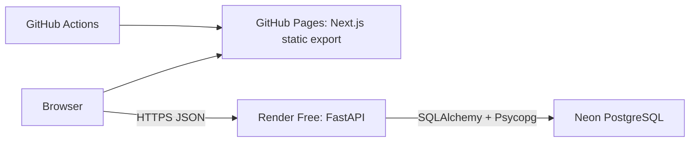

# Architecture

SewnCovers is two deployables and one database: a static Next.js site on GitHub Pages, a FastAPI service on Render, and a Neon PostgreSQL database that only the API can reach.

Next.js exports plain HTML, CSS and JavaScript. GitHub Pages serves them under the case-sensitive `/SewnCovers` base path; there is no frontend server and no server-side rendering at runtime. The browser calls the API directly at the public, build-time `NEXT_PUBLIC_API_URL`. FastAPI is the only component that receives `DATABASE_URL` or talks to the database.

## Frontend

Next.js 16 (App Router), React 19, TypeScript in strict mode and Tailwind CSS v4. The runtime dependencies are `next`, `react` and `react-dom` and nothing else.

### Layout

| Path | Responsibility |
| --- | --- |
| `app/` | Routes (all server components), metadata, `globals.css` (design tokens), self-hosted fonts. |
| `components/configurator/` | The six-stage configurator, preview, review, save and share. |
| `components/account`, `projects`, `commerce`, `assurance` | Account, private-project, sandbox-commerce and operations screens. |
| `components/ui/`, `components/layout/` | Design-system primitives; header, footer and the API warm-up. |
| `context/configuration/` | The configuration state: a pure reducer with discriminated-union actions, measurement rules and unit conversion. |
| `context/auth/` | Session state (`useSyncExternalStore` over `sessionStorage`). |
| `services/` | Typed API clients with runtime response validation, catalogue, save, share and draft logic. |
| `data/` | Shape metadata, cover options and the pattern-id to CSS-artwork mapping. |
| `config/` | Environment validation, static-export verifier and performance budget. |

Routes: `/` (landing), `/configure/`, `/legal/`, `/commerce/` (pricing), `/cart/`, `/orders/`, `/account/`, `/projects/`, `/admin/`, and the three `/checkout/*` pages, plus `404.html`, `robots.txt` and `sitemap.xml`. Runtime identifiers travel in query parameters (`/projects/?project=…`, `/configure/?design=…`) so a single exported page serves every record at both the domain root and the `/SewnCovers` base path.

### The configurator

Six stages: **Shape, Measurements, Cover details, Pattern, Preview, Review**. The editing subtree stays mounted while Review is visible, so going back to any stage preserves every choice. Central state lives in one `ConfigurationProvider` reducer; components read it and dispatch typed actions rather than keeping their own copies.

**Measurements.** Five shapes: square, rectangle, box / bench, round and tapered / trapezoid. Square and round keep their two face dimensions equal; box labels the stored `height` as depth; tapered adds a smaller back width. Face dimensions and back width are 10 to 300 cm, thickness is 1 to 60 cm, with at most two decimals, entered in centimetres or inches (`1 in = 2.54 cm`). Inputs keep a local display string while the visitor types and commit a value only when it is complete, finite, in range and within precision; invalid drafts stay visible with an inline, programmatically associated message. Switching units converts every committed value atomically, rounded to two decimals.

**Pattern.** `GET /patterns` is the runtime source of truth for catalogue metadata and order. The frontend owns only facet labels and the stable id-to-artwork mapping: all 15 patterns are CSS repeating gradients in `globals.css`, scaled by a `--pattern-scale` variable, so artwork costs no image requests and cannot lose the base path. An unknown id fails visibly instead of letting backend data choose a CSS class. A plain solid fabric colour is the alternative to a pattern. Filtering never changes the selected pattern. `services/pattern-catalogue.ts` validates the response (12 to 20 patterns, unique ids and names, a matching artwork entry for each) and never falls back to bundled metadata.

**Preview.** `PreviewStep` draws a shape-aware inline SVG (`640 × 430` view box) from measurement ratios only, via the pure `buildCushionGeometry`, with pattern fabric clipped to the silhouette. Thickness sets how far the edges puff; extreme values are clamped so the outline always stays legible. Fit and closure are recorded with the design but do not reshape the model. The preview is illustrative, and the text specification beside it is the authoritative description. Pattern scale (0.5× to 2.0×, step 0.1) is a visual multiplier, never a real-world measurement.

**Review and output.** `deriveReviewReadiness` reuses the same measurement, scale and catalogue checks and returns section-owned issues instead of a partial summary. A ready summary is a description list in a stable order; **Print summary** uses the native print flow with a print stylesheet; **Download summary** builds a plain-text file locally in the browser, with no request or stored data.

### Saving, sharing and restoring

- **Save.** Only available on a ready Review. The save boundary re-validates every field, then calls `POST /designs` **once**. The controller admits one request in flight, ignores duplicate clicks, locks the edit actions while the request is unresolved, and never retries automatically; recovery is an explicit "Try saving again". See [ADR 0002](adr/0002-immutable-designs-no-post-retry.md) for why.
- **Share link.** The response must exactly match the submitted configuration and carry a 22-character URL-safe `publicId`. The link is `<origin><basePath>/configure/?design=<publicId>`, with a read-only URL field and a Copy button that degrades to select-for-manual-copy.
- **Restore.** The page reads exactly one `design` query value, validates its format locally (no request for a malformed id), fetches the public record, re-validates every field, and waits for the design's pattern to exist in the current catalogue. Restoration is one atomic reducer action. A version counter invalidates pending work the moment the visitor edits anything, so a late response never overwrites a newer edit. Legacy records without the newer fields restore with `backWidth: null`, Cotton canvas, Standard fit, Zipper and Plain seam. Failures keep the visitor's current configuration, and **Continue with my configuration** removes only the `design` parameter with `history.replaceState`.

### API client

`services/api-client.ts` owns the public endpoints and `services/account-api.ts`, `commerce-api.ts` and `assurance-api.ts` the authenticated ones. All of them read only the statically inlined API origin and validate every response at runtime; unknown shapes become a typed `malformed-response` error rather than data in the UI.

- Each attempt has its own `AbortController` and a 20 second timeout.
- Safe `GET`s retry up to two more times (after 500 ms and 1 s) on timeout, network failure, or HTTP 408, 425, 429, 500, 502, 503 or 504. Permanent 4xx responses and malformed successes never retry.
- `POST /designs` is never retried automatically.
- Callers can subscribe to `connecting`, `cold-start`, `retrying`, `success` and `failure` states. After two seconds without a response the UI says the API *may* be waking and can take up to a minute.
- Errors are classified as `configuration`, `timeout`, `network`, `http`, `backend-contract` or `malformed-response`. Exception details, response bodies, URLs, submitted designs and credentials are never logged or shown.
- On the home page, `ApiWarmup` sends one quiet `/health` request per browser session so a sleeping Render instance starts waking before the visitor reaches the Pattern stage.

### Accounts, drafts and storage in the browser

- **Guest first.** Everything from the landing page to save, share, print and download works without an account. Sign-in is asked for, inline and without navigation, only at account-only actions (private project, cart, custom upload). See the interaction notes in [design](design.md#guest-first-sign-in).
- **Session token.** After login the API returns an opaque bearer token once. The browser keeps it only in `sessionStorage` and sends it as `Authorization: Bearer`; it is cleared on logout, revocation, expiry, account deletion and any authenticated `401`. It is never put in `localStorage`, cookies, URLs or the saved draft. This avoids a cross-site cookie dependency (the site and API are on different domains) but means a successful same-origin script injection could read it; this is a portfolio-grade design, not a commercial one.
- **Draft.** The design in progress is kept in `localStorage` (`sewncovers.configurator-draft`) so a reload or a sign-in never loses it, with in-memory fallback when storage is blocked.
- **Content Security Policy.** GitHub Pages cannot set response headers, so the site ships a CSP `<meta>` tag, which requires `'unsafe-inline'` for Next's inline scripts.

### Accessibility and build verification

Keyboard operation, visible focus, 44 px targets, labelled landmarks, live-region stage announcements, reduced-motion and forced-colours support, and a print stylesheet are built in and checked by hand-written unit and Playwright tests (see [testing](testing.md)); there is no automated axe audit. `npm run verify:export` asserts the exported routes, titles, canonical and Open Graph tags, base-path-prefixed assets, the social image and the embedded API URL; `npm run verify:performance` asserts first-load JavaScript budgets per route.

## Backend

FastAPI with Pydantic v2 and synchronous SQLAlchemy 2 sessions on Psycopg 3, a single Uvicorn worker, Alembic migrations, Argon2id password hashing and Python 3.13.

### Layout

`backend/app/` is organised by capability. Each package has an `api.py` (route functions), `schema.py` (Pydantic contracts) and `service.py` (use-case rules and transactions); `designs/` and `patterns/` add a `repository.py`. `main.py` registers every route and middleware.

| Package | Responsibility |
| --- | --- |
| `patterns/`, `designs/` | The public catalogue and immutable anonymous designs. |
| `accounts/` | Registration, login, sessions, Argon2id and token primitives, a process-local credential throttle, export and deletion. |
| `projects/` | Private named projects, immutable versions, revocable read-only shares. |
| `uploads/` | Private custom patterns: intents, strict image processing, moderation, object storage (filesystem or S3), a durable worker. |
| `commerce/` | Price books, quotes, cart, checkout, payment events, orders, refunds, administration, audit. Includes the deterministic sandbox provider and a configured-only Stripe adapter. |
| `assurance/` | Versioned legal documents and acknowledgements, production work and quality control, trust metadata and the read-only readiness report. |
| `persistence/` | Lazy engine and session ownership, ORM models, transaction helpers, migration metadata. |
| `settings.py`, `errors.py`, `health.py`, `production.py` | Typed settings, the error contract, the health check, the migration-gated production entry point. |

### Request flow

A route depends on a service, never on a session or SQLAlchemy directly. The service validates the use case and wraps repository work in `service_transaction`, which commits only after the whole operation succeeds and rolls back on every failure without masking the original exception. Repositories execute statements, may flush, and never commit. The request session comes from the `DatabaseSession` dependency, which rolls back on error and always closes.

The engine is created on the first database request. Importing the app, constructing it, starting it, calling `/` or answering a CORS preflight never creates an engine or opens a connection, which is what lets the whole test suite run without a database server.

### Authentication and authorization

- Email addresses are normalised; passwords are 12 to 128 characters with no composition rule and hashed with Argon2id.
- A login or registration returns a 32-byte URL-safe random token **once**. Only its SHA-256 digest is stored, with a seven-day expiry and optional revocation, and comparison is constant-time. Sessions can be listed and revoked individually, or all at once.
- Missing, malformed, unknown, expired and revoked credentials all produce the same `401`. A wrong password, an unknown email and a duplicate registration produce one generic body.
- Every owned read and mutation (projects, versions, shares, uploads, quotes, cart, orders, sessions) filters by the authenticated account; a cross-account or missing resource returns the same non-disclosing `404`. Ids never authorize access.
- The administrator role exists only in the database, is assigned by an explicit CLI command that writes an audit row, and is checked in the service layer before any administrator operation runs.
- A process-local rolling limiter allows five credential attempts per five minutes per key. It is a focused safeguard, not distributed abuse protection.
- Email verification and password recovery are not implemented.

### Feature flags

`COMMERCE_ENABLED` and `CUSTOM_UPLOADS_ENABLED` are both `false` unless set. When off, their routes return `503 storage_unavailable` with a fixed message, and `/readiness` reports them as disabled. Production start-up additionally refuses combinations that would be unsafe (uploads without S3 storage and real moderation, commerce without a complete provider, webhook, encryption and contact configuration, development moderation results). See [ADR 0006](adr/0006-feature-flags-off-in-production.md).

### Browser access and response headers

- **CORS.** Exactly one origin per process, with credentials disabled and a 600 second preflight cache. Local development defaults to `http://localhost:3000`; production refuses to start with anything but `https://nicolasfrechette91.github.io` (the `/SewnCovers/` suffix is a path, not part of an origin). Allowed methods are `DELETE`, `GET`, `PATCH`, `POST` and `PUT`; allowed request headers are `Authorization` and `Content-Type`. CORS is not authentication.
- **Headers.** Every API response carries `X-Content-Type-Options: nosniff`, `Referrer-Policy: no-referrer`, a restrictive `Permissions-Policy`, `X-Frame-Options: DENY` and (except on the documentation pages) `Content-Security-Policy: default-src 'none'; frame-ancestors 'none'`. Authenticated, account, admin, asset, `/health` and `/readiness` responses add `Cache-Control: private, no-store`.

### Errors

Every failure outside `/health` uses one envelope, `{"errors": [{"code", "message", "location"}]}`, built centrally from validation, domain, routing, database and unexpected failures. Responses never include submitted values, exception text, SQL, constraint names, internal ids, credentials or stack traces; unknown and infrastructure failures return fixed messages, and unexpected programming errors stay `500` rather than being relabelled as validation. The full contract is in [api](api.md#errors).

### Rules that exist on both sides

The measurement ranges, the two-decimal precision, the 2.54 conversion, the pattern-scale bounds and the tapered back-width rule are enforced in the browser for immediate feedback and again in the API, which is authoritative. They are declared separately in `frontend/context/configuration/` and `backend/app/designs/`, so a change to one must be mirrored in the other; the tests on each side pin the values.
